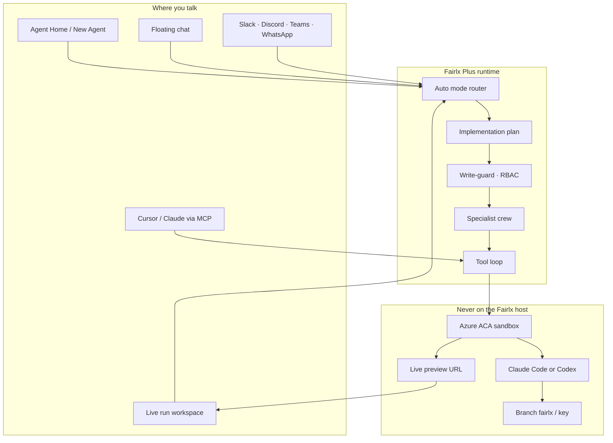
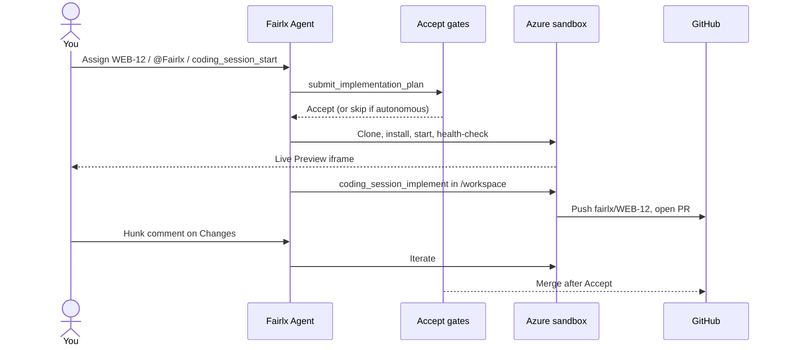
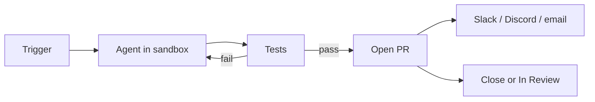
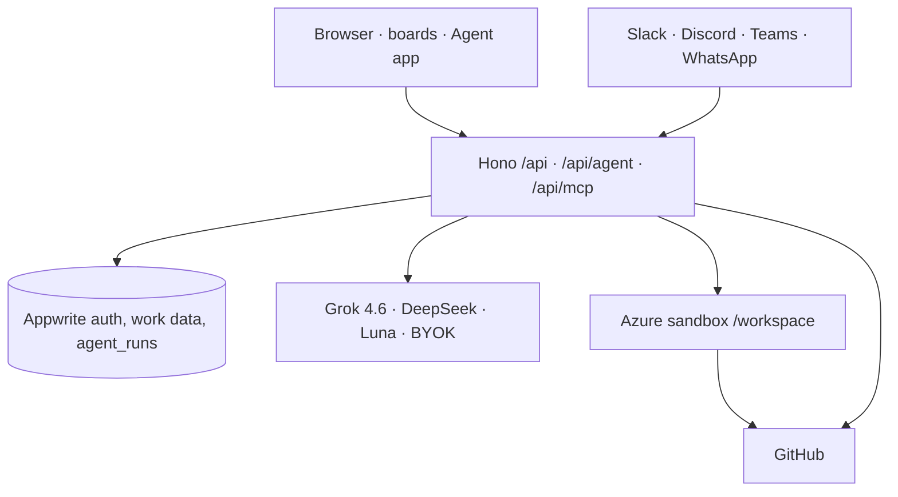

# Fairlx

<div align="center">


### The work OS with an agent that actually ships

Plan the sprint. Assign the bug. Watch a live preview boot in the cloud. Review the diff. Merge the PR — without git or a shell ever touching the Fairlx host.

[](https://nextjs.org/)
[](https://www.typescriptlang.org/)
[](https://appwrite.io/)
[](https://azure.microsoft.com/)

**Fairlx** is the agile work OS. **Fairlx+** (Fairlex Plus) is the in-app agent — Personal Agent, cloud coding, sandbox previews, automation loops, MCP, and `@Fairlx` in Slack and Discord.

[Features](#features) · [vs Linear & Jira](#smarter-than-the-tracker) · [Architecture](#how-the-agent-works) · [Quick start](#quick-start) · [Docs](#docs)

</div>

---

## What you have

| Layer | What it is |
|-------|------------|
| **Work OS** | Organizations → workspaces → spaces → projects → sprints → work items, with custom workflows, RBAC, and billing |
| **Fairlx Agent** | The main workspace operator. Inspects, plans, codes, and delegates — it is not your Personal Agent |
| **New Agent** | Starts a fresh run from Agent Home, with the full coding / GitHub / automation tool set |
| **Personal Agent** | A trained Chief of Staff that briefs you and acts the way you would |
| **Cloud coding** | Azure sandbox clone → install → live Preview → Claude Code or Codex in `/workspace` → PR from `fairlx/{key}` |
| **Loops** | Trigger → agent → test → PR → notify. Bugs, ready stories, and Slack `@Fairlx` threads |
| **MCP** | Cursor talks *to* Fairlx. Fairlx talks *out* to Sentry, Datadog, and any HTTP MCP server |

Git and shell **never** run on the Fairlx box. Implementation happens in an Azure Container Apps sandbox bound to a work item.

---

<h2 id="features">Features ✨</h2>

The product is one stack: a serious tracker, plus an agent that can finish the work.

### Work OS

- Personal or organization accounts, with shared billing on orgs
- Scrum, Kanban, or Hybrid boards — sprints, WIP limits, burndown, velocity
- Custom statuses, transitions, approvals, and team rules
- Tasks, stories, bugs, epics, subtasks, custom fields, and eight link types
- Spaces, programs, project teams, and saved views (board, list, calendar, timeline)
- GitHub repos on the project, comments, docs, time tracking, and audit logs

### Fairlx+ Agent

- **Agent Home**, floating chat on every work page, and a live run workspace
- Modes: Auto, Agent, Personal, Plan, Debug, Ask
- Implementation plans with **Accept** before code (unless you turn on autonomous coding)
- Specialists: planner, researcher, builder, git, tester, reviewer, ops, security, workflow
- Azure sandbox with a **health-checked live preview** — stub URLs are never iframed as live
- In-sandbox **Claude Code** or **Codex** when keys exist; Fairlx specialists as an explicit fallback
- Preview · Terminal · Changes (unified diff, checks, hunk comments that resume the run)
- Skills, work patterns, knowledge base, and `persist_memory`
- Staged vs All access, plus an **Autonomous coding** toggle (`@Fairlx-auto` does the same)

### Automations, MCP, and chat

- Visual loops: **Bug → fix → test → PR**, **Ready story → build**, **Slack `@Fairlx` → do it**
- Outbound MCP (`POST /api/mcp`, ~100 `fairlx_*` tools) for Cursor / Claude Code / Codex
- Inbound MCP from Agent → Manage MCP (`mcp_list` / `mcp_call`)
- Slack `/fairlx` commands and `@Fairlx` / `@Fairlx-auto` on Slack, Discord, Teams, and WhatsApp
- GitHub, Outlook, Gmail, Resend, and a security review that scans — it never exploits production

---

<h2 id="smarter-than-the-tracker">Smarter than the tracker 🧠</h2>

Jira tracks work. Linear made tracking fast — and added a cloud coding agent. Fairlx is a **full work OS whose agent already knows the board, the sprint, the repo, and your taste**.

The intelligence is not a chatbot bolted on the side. The same runtime that lists `WEB-12` is the one that opens the Azure preview and waits for Accept.

| | **Jira** | **Linear** | **Fairlx+** |
|---|:---:|:---:|:---:|
| Org → workspace → space → project hierarchy | Heavy | Light | Native |
| Custom workflows, teams, programs, billing, RBAC | Yes | Limited | Yes |
| Issue → cloud sandbox → **live preview** → diff → merge | — | Yes | Yes (Azure ACA, iframe only when healthy) |
| Coding agent **inside** the sandbox | — | Claude Code / Codex | Claude Code / Codex, with an explicit specialist fallback |
| Host isolation (no git/shell on the product box) | n/a | Cloud VM | Fairlx host never runs git/shell |
| Plan first, then code (Accept gates) | Manual | Agent-led | Plan card + Staged / Autonomous coding / `@Fairlx-auto` |
| Trained **Personal Agent** (Chief of Staff) | — | — | Yes — will not take work until trained |
| Mode router (Plan / Debug / Ask / Agent) | — | — | Auto picks the mode per turn |
| Specialist crew (planner, builder, git, QA, security…) | — | — | In-app crew + `delegate_agent` |
| Knows **backlog vs current sprint** | You configure it | Issue-centric | Agent asks or infers; assignments show on the board |
| MCP **into** the product (Sentry, Datadog…) | Marketplace | Yes | Manage MCP + `mcp_call` |
| MCP **out** (Cursor operates Fairlx) | — | — | `fairlx_*` tools, skills, coding sessions |
| `@agent` in Slack / Teams | Plugins | Yes | `@Fairlx` **and** Discord, WhatsApp |
| Slash commands that raise work **and** start a sandbox | Plugins | Limited | `/fairlx fix WEB-12`, `/fairlx build`, `/fairlx sessions` |
| Visual automation that **codes** (test-fail loops back) | Ticket automation | Agent | Trigger → sandbox → test → PR → Slack |
| Project Coding env + encrypted secrets | — | Workspace env | Project Settings → Coding |

**Where Fairlx is actually smarter**

1. **It already has the work graph.** Linear’s agent is excellent at *an issue*. Fairlx’s agent sees the space, the sprint, Unassigned vs membership ids, custom workflows, and docs — then codes against that.
2. **It plans like a senior, then waits.** Build work must `submit_implementation_plan` and wait for Accept. A new focused change gets a new plan; leftover phases of an old plan are not blindly executed.
3. **It has two minds.** The Fairlx Agent is a general operator. The Personal Agent is *you* — trained or self-trained on your role — and will not stand in until that profile exists.
4. **It does not fake a preview.** `previewLive` is true only after a sandbox health-check. `preview.stub.fairlx.local` is never shown as a running app.
5. **It is bidirectional.** Cursor can drive Fairlx over MCP; Fairlx can call *your* MCP servers. Jira stops at marketplace apps; Linear is inbound-first.
6. **Chat is an operations surface.** `@Fairlx` in Slack or Discord is the same coding session as Agent Home — not a notification bot.

---

<h2 id="how-the-agent-works">How the agent works 🏗️</h2>

One runtime. Several doors in. One write-guard. Cloud for code.



### A coding session



**States:** `queued` → `preparing` → `running` → `awaiting_review` → `iterating` → `merging` → `merged`  
Terminal: `failed`, `stopped`.

Preview iframes only when the health-check passes. Default sandbox port is **3000**. Project Settings → **Coding** can override runtime, start command, `exposePort`, and secret names (AES-GCM at rest).

### Who is talking

| Name | What it is |
|------|------------|
| **Fairlx Agent** | Mode `agent`. General operator. Does not speak in your trained voice. |
| **New Agent** | The **New Agent** control — a new run — plus the expanded tool set (sandbox, GitHub write, delegate, memory, notify). |
| **Personal Agent** | Mode `personal`. Chief of Staff. Train in chat or **Self-train** from your workspace. Stand-in comments are labeled; they never impersonate your account. |
| **Cloud coding** | Not another chat. A bound `agent_coding_session` + Azure box. |

**Auto** reads the message and picks Plan, Debug, Ask, Personal, or Agent. **Plan** writes the plan and does not edit. **Ask** answers with tools off unless you request an action. **Debug** finds the failure, then a focused fix.

### Automation loops

Loops are graphs compiled into **one** agent run. There is no second engine.



| Template | When |
|----------|------|
| Bug → fix → test → PR | A `BUG` is raised |
| Ready story → build → PR | Story hits Ready; supervisor can be required |
| Slack `@Fairlx …` → do it | Thread mention on a linked item |

Triggers also include assign-to-Fairlx, status change, comment mention, and a manual Run button. Events debounce per automation.

---

<h2 id="slack-and-discord">Slack and Discord 💬</h2>

`@Fairlx` on a work item, Slack event, Discord interaction, Teams webhook, or WhatsApp message **starts or resumes** the bound coding session. Include a key (`WEB-12`). **`@Fairlx-auto`** skips extra Accepts on the coding loop.

| | Slack | Discord |
|---|--------|---------|
| Raise work | `/fairlx bug\|story\|task <title>` | `/fairlx create` |
| Ship it | `/fairlx fix WEB-12` · `/fairlx build` | `@Fairlx` on the thread |
| Inspect | `/fairlx show` · `list` · `sessions` · `preview` · `pr` | Mentions share the Slack pipeline |
| Loops | `/fairlx automations` · `/fairlx run <name>` | Same inbound handler |

Events URL: `{APP_URL}/api/integrations/slack/events`  
Interactions: `{APP_URL}/api/integrations/discord/interactions`

---

## MCP

**Out** — Fairlx is the server. Cursor / Claude / Codex call `fairlx_work_item_*`, `fairlx_sprint_*`, docs, members, and `fairlx_coding_session_*`.

```bash
export FAIRLX_API_URL=http://localhost:3000/api/mcp
export FAIRLX_API_TOKEN=flx_live_sec_...
npm run mcp
```

Destructive tools need `confirm: true` and a 120s challenge token. Skills shipped with the server: plan-sprint, standup, triage, risk-check, rebalance-capacity, generate-prd.

**In** — Agent → **Manage MCP**. Add Sentry, Datadog, Outlook MCP, anything HTTP. `mcp_call` runs those tools. Native Fairlx tools stay `fairlx_*`.

---

## Live run workspace

`/agent/workflow?runId=` is the coding IDE inside Fairlx:

- Chat, Accept / Deny, crew, activity timeline
- Sidebar: **Plan · Context · Changes · Terminal · Preview**
- Changes: diff, checks, walkthrough, hunk comments
- Preview: live iframe only when `previewLive`

Agent app: **Home · Chats · Projects · Workspaces · Git & staging · Skills · Tools · MCP · Automations · Integrations · Knowledge · Settings**

Git & staging is a **buffer**. Real commits happen in the sandbox (or GitHub API when no sandbox is bound — never Contents-API dumps while one is).

---

## Architecture



**Work data flow:** UI → TanStack Query → Hono → Appwrite → cache. Mutations go through Zod, billing guards, and RBAC.

**Agent turn:** composer (mode + model) → tool loop → write-guard → Fairlx / GitHub / sandbox / notify → persist `agent_runs`.

**Platform models:** Grok 4.6 (orchestrator in Auto), DeepSeek V4 Flash (worker), DeepSeek V4 Pro and GPT-5.6 Luna (manual). Add BYOK in **Manage Models**. Claude/Codex in the sandbox are separate from chat models. Token usage on platform models is billed on the bound run; BYOK is not.

---

<h2 id="quick-start">Quick start 🚀</h2>

```bash
git clone https://github.com/Happyesss/Fairlx.git
cd Fairlx
npm install
cp .env.example .env.local
npm run db:setup:agent
npm run dev
```

Open [http://localhost:3000](http://localhost:3000), create an account, then **Agent Home** at `/agent/dashboard`.

1. Connect GitHub on the project  
2. Optional: fill `AZURE_SANDBOX_*` for a **live** preview (empty = stub, Preview stays “not live”)  
3. Optional: Anthropic / OpenAI keys so Claude Code or Codex run in the box  
4. Set `FAIRLX_AGENT_USER_ID` to a real member, assign a work item — or just ask the agent to build  
5. Connect Slack or Discord under **Integrations**

Need the full collection list? Use [`.env.example`](.env.example) and [md/APPWRITE_SETUP.md](md/APPWRITE_SETUP.md).

<details>
<summary><strong>Agent environment (compact)</strong></summary>

| Variable | Purpose |
|----------|---------|
| `INTEGRATION_ENCRYPTION_SECRET` | GitHub tokens + Fairlx secrets (AES-GCM) |
| `AZURE_SANDBOX_*` | Tenant, client, subscription, RG, group, region |
| `FAIRLX_SANDBOX_CODING_AGENT` | `auto` \| `claude` \| `codex` \| `specialists` |
| `ANTHROPIC_API_KEY` / `OPENAI_API_KEY` | In-sandbox CLIs |
| `AGENT_GROK_*` / `AGENT_DEEPSEEK_*` / `AGENT_FOUNDRY_*` | Platform chat models |
| `FAIRLX_AGENT_USER_ID` | Assign-to-agent member |
| `SLACK_CLIENT_*` / `DISCORD_CLIENT_*` | Chat apps |
| `AGENT_CHAT_TIMEOUT_MS` | Default `480000` (8 min) |

</details>

```bash
npm run mcp              # Fairlx MCP stdio for Cursor
npm run db:setup:agent   # Agent Appwrite collections
npm run test:run         # Vitest
```

---

## Stack

Next.js 15 · React 18 · TypeScript · Tailwind · shadcn/ui · TanStack Query · Hono · Appwrite · Azure Container Apps Sandboxes · MCP · Slack / Discord · Razorpay · Gemini (workflow assistant, not the coding loop)

---

## Docs

| | |
|---|---|
| [docs/coding-sessions.md](docs/coding-sessions.md) | Canonical sandbox, preview, and `@Fairlx` spec |
| [packages/fairlx-mcp/README.md](packages/fairlx-mcp/README.md) | Outbound MCP auth and CLI |
| [CONTRIBUTING.md](CONTRIBUTING.md) | Branching, PRs, hooks |
| [changelog.md](changelog.md) | Commit history (auto-generated) |
| [md/APPWRITE_GUIDE.md](md/APPWRITE_GUIDE.md) | Collection schemas |

The in-app runtime is the guarded path. `packages/fairlx-multi-agent` is an optional CLI DAG **without** write-guard — use Agent Home for real work.

---

## Security

- Email verification, OAuth, HTTP-only sessions, multi-level RBAC
- Agent writes wait for Accept unless All access / autonomous coding
- No git/shell on the Fairlx host; secrets listed by **name only**
- `security_review` scans source; it does not attack production
- Suspended billing accounts cannot mutate

Report vulnerabilities privately (GitHub security advisories), not in public issues.

---

## License

MIT — see [LICENSE](LICENSE).

<div align="center">

**Track the work. Train the agent. Watch the preview boot.**

[Back to top](#fairlx)

</div>
